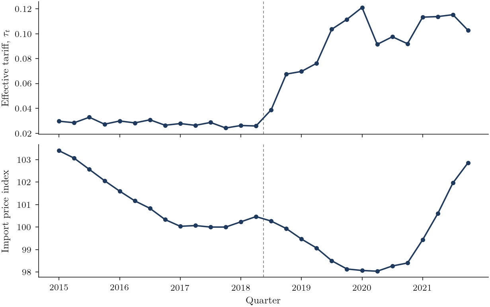
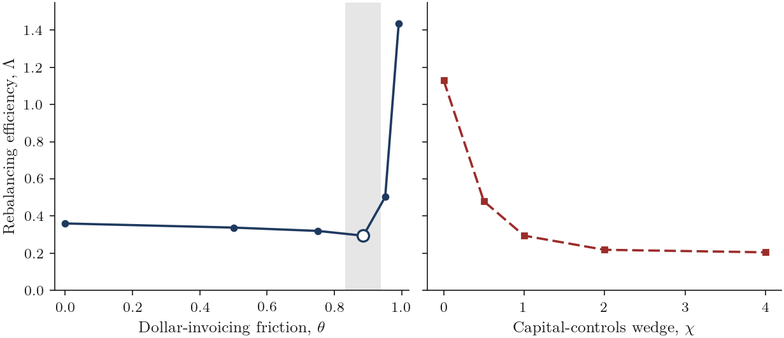

# Can a Weaker Dollar Rebalance Trade?

**Authors.** Geoffrey Ducournau (Dimtech S.A.S) · Jalal Qanas (College of Business and
Economics, Qatar University) · Jinliang Li (School of Economics and Management, Tsinghua
University, Beijing, China).

This repository reproduces the empirical and structural results of the paper. The
manuscripts, the generated results, and the data-acquisition code are kept in the working tree
but are not published here (see the data policy below).

## Abstract

Can a dollar depreciation engineered through tariffs rebalance United States trade with China?
The paper combines product-level evidence from the 2018-2019 tariff waves with a two-country
New Open Economy Macro model featuring dominant-currency pricing, incomplete markets, and a
capital-controls wedge, whose parameters are estimated on the same episode wherever the data
identify them. The tariff is not offset in the dollar border price of
Chinese goods, so it passes to United States importers and trade adjusts on quantities. In the
structural analysis, a diagnostic impact bound shows that closing the bilateral imbalance
through the exchange rate requires a real appreciation of the renminbi far beyond any tolerable
cost. The mechanism ranking comes from the general-equilibrium model: the binding friction is
the closed Chinese capital account rather than dollar invoicing. Dominant-currency pricing
shapes who bears the tariff; capital controls decide whether the exchange rate can rebalance
trade.

## Main results at a glance

**The tariff falls on United States importers, and trade adjusts on quantities.**



*Figure 1. The effective tariff (upper) and the dollar border price of imports from China
(lower). The border price holds flat as the tariff climbs, so Chinese exporters did not cut their
dollar prices.*

**Capital controls, not dollar invoicing, are the binding friction.**



*Figure 2. Rebalancing efficiency against the dollar-invoicing friction (left) and the
capital-controls wedge (right). Efficiency barely moves as invoicing rises but collapses as the
capital account closes.*

These figures are illustrative copies of Figures 1 and 2 of the paper; `python reproduce.py`
regenerates the underlying figures.

## Research questions

1. Does a bilateral tariff transmit to trade through the dollar border price of imported goods
   or through quantities?
2. Can an engineered depreciation of the dollar rebalance bilateral trade, and if not, which
   friction binds?

## Hypotheses

- **H1** Under dominant-currency pricing the dollar border price does not fall with the tariff,
  so the tariff passes to importers and trade adjusts on quantities.
- **H2** In an impact-bound feasibility test, no engineered depreciation closes the bilateral
  imbalance at a bounded activity cost.
- **H3** The rebalancing a weaker dollar buys per unit of output-gap cost falls by less when
  dollar invoicing rises from none to its estimated level than when the capital account closes.

## Main results

- **H1.** The border-price response to the effective tariff is 0.24 (wild-cluster bootstrap
  p = 0.14, 22 industry clusters). The tariff semi-elasticity of import value is -2.18 (s.e.
  0.17): a ten-percentage-point tariff rise lowers import value by 19.6 percent. Pre-trends are
  flat, and a stacked difference-in-differences with the Wing-Freedman-Hollingsworth corrective
  weights gives an average post-treatment effect of -0.30.
- **Estimated parameters.** Import-demand elasticity 2.53 (s.e. 0.20, log gross tariff);
  exchange-rate pass-through into the dollar import price of Chinese goods 0.39 after four
  quarters, implying a dollar-invoicing friction of 0.885 (s.e. 0.027); tariff persistence 0.96;
  2017 import share 0.80, bilateral openness 3.2 percent of output, and initial imbalance 1.9
  percent of output (Census Bureau and Bureau of Economic Analysis). The remaining parameters are
  calibrated and varied one at a time.
- **H2.** In the impact-bound feasibility test, closing the imbalance requires a real
  appreciation of the renminbi of 676 percent at the baseline frictions and still 39 percent
  without any friction, against a tolerable maximum of 25 percent: bilateral trade is too small
  relative to US output. This bound is diagnostic; H3 supplies the mechanism ranking.
- **H3.** In general equilibrium, the rebalancing a weaker dollar buys per unit of output-gap
  cost falls by 18 percent from producer-currency pricing to the estimated invoicing friction
  (between -15 and +11 percent across its confidence interval) and by 82 percent as the
  capital-controls wedge rises from 0 to 4. The ranking holds in all 18 one-way calibration
  changes.

Every number is regenerated by `python reproduce.py` and fingerprinted in
`protocol/results_manifest_public.json`.

## Repository layout

```
src/
  common/    shared constants, portable paths, the two-way fixed-effects estimator
  data/      loading and reading the shipped transformed data
  engine/    the structural model (calibration, impact bound, general-equilibrium solution)
  analysis/  the panels, event studies, stacked design, and counterfactuals
  figures/   figure and table scripts (EN and FR)
data/        transformed input data (see data/README.md) and data policy
protocol/    results manifest (public data)
reproduce.py single deterministic entry point
```

## Reproduction

```
python -m pip install -r requirements.txt
cp .env.example .env.local   # credentials are needed only for the licensed firm-level data
python reproduce.py
```

`reproduce.py` rebuilds the figures and tables in English and French and reports `MATCH` when
every headline number equals the manifest. The public reproduction does not need licensed data.

## Data policy

Trade flows and duties (United States Census Bureau), import prices (Bureau of Labor
Statistics), the tariff calendar (Peterson Institute for International Economics), the
input-output tables (OECD), the renminbi exchange rate (Federal Reserve H.10) and US output
(Bureau of Economic Analysis), both through FRED, are public, and their transformed versions ship in `data/`. Firm
fundamentals from Compustat (Wharton Research Data Services) are licensed and not
redistributable; they enter only the firm-level analysis, are not versioned here, and are
available on request.

## Contact

geoffrey.ducournau@111dimtech.com
